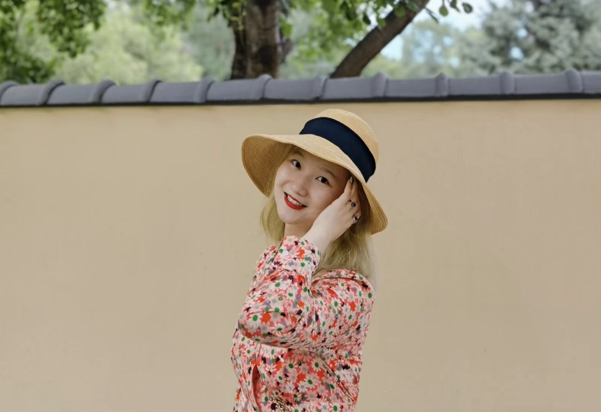

  
# Feel free to reach out!

<!-- Add margin-top and margin-bottom to the image for spacing -->
{style="margin-top: 20px; margin-bottom: 20px;"}

I am a first-year Master’s student in Biostatistics at the Mailman School of Public Health, Columbia University. Recently, I earned my Bachelor of Medicine degree, and my research interests focus on applying statistical methods to rare disease studies. In my free time, I enjoy exploring coffee shops, hiking, and discovering new clubs.

## My Resume

[If you're interested in my education and research experience, click here.](my_resume.html)

## My Team

[If you're interested in my biotech startup, click here.](my_team.html)
