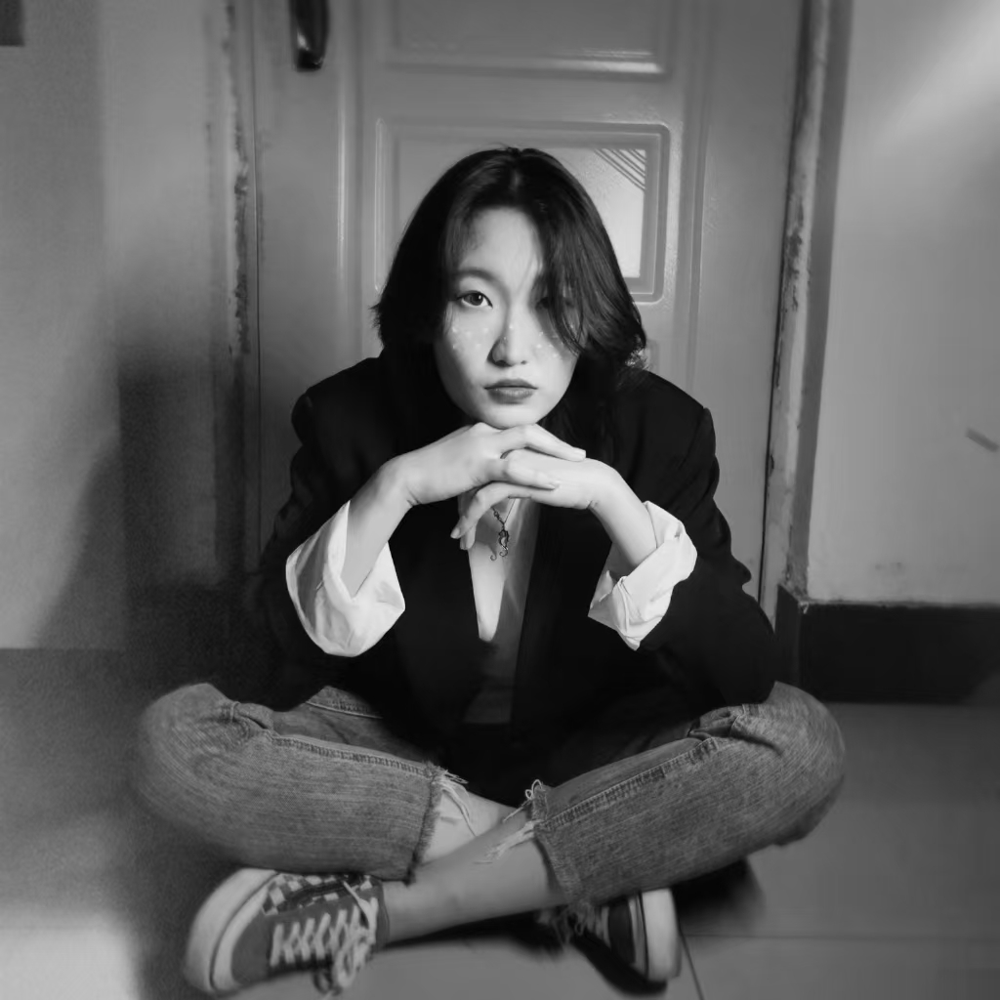
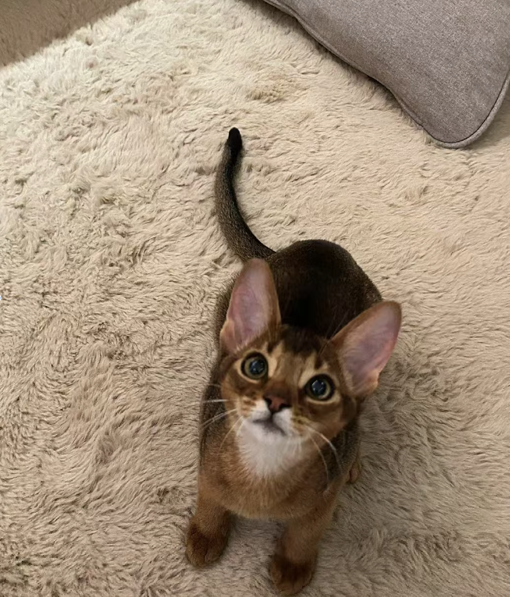

```{r setup, include=FALSE}
knitr::opts_chunk$set(echo = TRUE)
```

# We are A&G Biosciences Ltd.!
<b>

## Harper Sun

<!-- Add margin-top and margin-bottom to the image for spacing -->
{style="margin-top: 20px; margin-bottom: 20px;"}
<br> <div style="text-align: justify; text-indent: 2em;"> Hello everyone! My name is Harper, and I'm a first-year graduate student in Bioinformatics at Tongji University. I’m fluent in four languages: English, Japanese, Chinese, and French. Currently, I’m exploring different research directions to discover where my true interests lie. In our team, I take on the role of Human Resources, supporting and coordinating our efforts. </div>

<b>

## Sherlock

<!-- Add margin-top and margin-bottom to the image for spacing -->
{style="margin-top: 20px; margin-bottom: 20px;"}
<br> <div style="text-align: justify; text-indent: 2em;"> Hello! I’m an Abyssinian cat and the proud mascot of A&G. Playful, curious, and always here to bring a little extra joy to your day! </div> 

